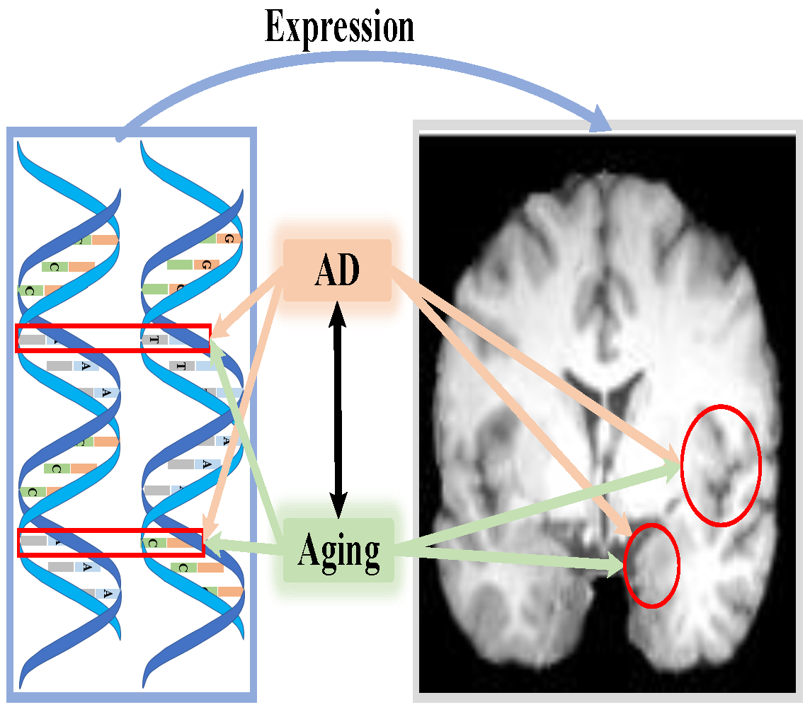

# A Sparse transformer for imaging genetic association analysis of Alzheimer's disease and brain aging

Source codes for the paper "A Sparse transformer for imaging genetic association analysis of Alzheimer's disease and brain aging".

## Task Overview



## Training

```bash
# The training process of MRI feature extraction
python train_mri.py
# The training process of MRI and SNP association
python train_gene2mri.py
```
## Testing

```bash
# The testing process of MRI feature extraction
python test_mri.py
# The testing process of MRI and SNP association
python test_gene2mri.py
```

## License

This project is licensed under the MIT License - see the [LICENSE](LICENSE) file for details.
