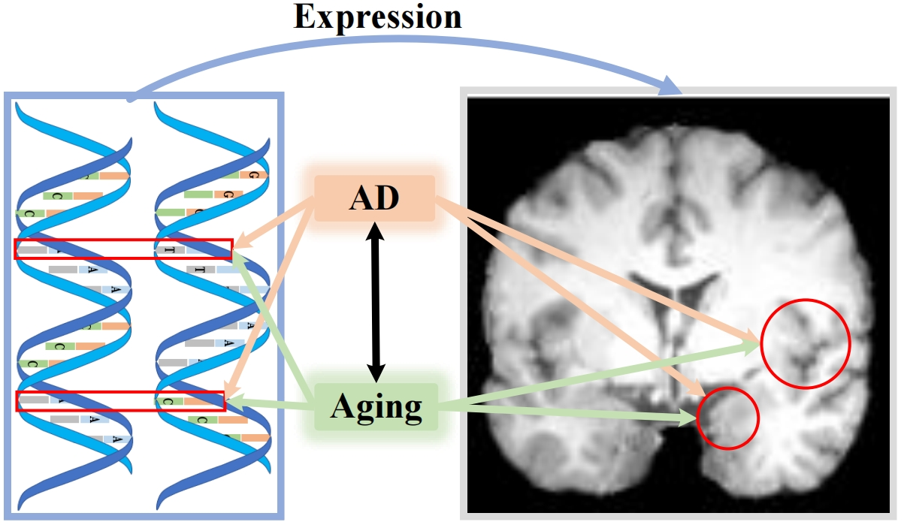

# A Sparse transformer for imaging-genetic association analysis of Alzheimer's disease and brain aging

Source codes for the paper "A Sparse transformer for imaging-genetic association analysis of Alzheimer's disease and brain aging".

## Task Overview



## Training

Explain how to train the model

```bash
# The training process of MRI feature extraction
python train_mri.py
# The training process of MRI and SNP association
python train_gene2mri.py
```
## Testing

Explain how to test the model and evaluate its performance.

```bash
# The testing process of MRI feature extraction
python test_mri.py
# The testing process of MRI and SNP association
python test_gene2mri.py
```

## License

Include the license information.

This project is licensed under the MIT License - see the [LICENSE](LICENSE) file for details.
